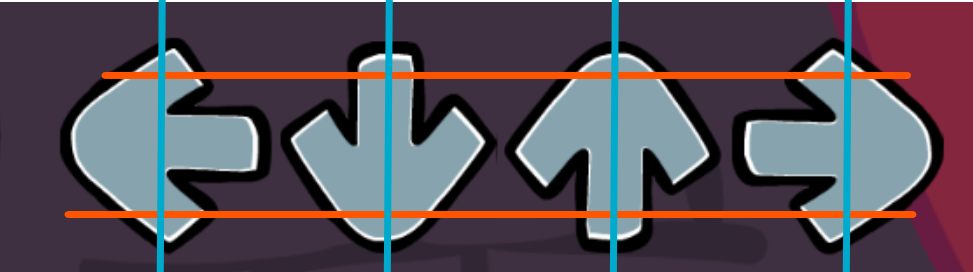

# AutoFunkin
Python bot that plays [Friday Night Funkin'](https://github.com/ninjamuffin99/Funkin) and impresses your friends.

Coordinates must be set in main.py to tell the script where on screen to check. Below is an example of roughly where each line should be set.
  

Since this is just a one day project, it does not know how to hold notes. Regardless, it still rarely misses anything unless being run against some of the harder mods.